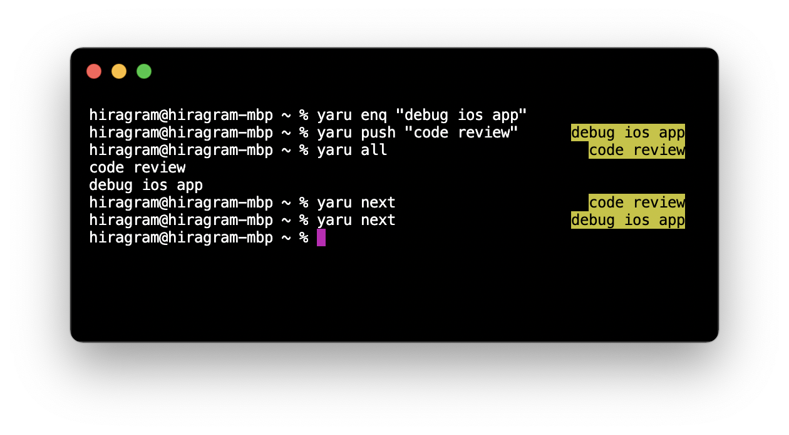

# Yaru

Yaru is a command line tool that manages simple tasks.

_The word "yaru(やる)" means "do" in Japanese._

## Usage

To add a new task, simply run `yaru enq TASK`. The subcommand "enq" stands for "enqueue".

And then, run `yaru current` to show what to do right now.

```zsh
$ yaru enq "debug ios app"
$ yaru current
debug ios app
```

When you have got interrupted by the other task, use a subcommand called "push". The new task is inserted at head of your task list.

You can see all tasks in your list using subcommand called "all".

```zsh
$ yaru push "code review #12345"
$ yaru current
code review #12345
$ yaru all
code review #12345
debug ios app
```

When you completed your task, run `yaru next` to mark current task as completed and start next task.

```zsh
$ yaru next
$ yaru current
debug ios app
```

## Installation

### Install using Mint (Recommended)

Use [Mint](https://github.com/yonaskolb/Mint) to install Yaru.

```zsh
$ mint install hiragram/yaru@main
🌱 Cloning yaru main
🌱 Resolving package
🌱 Building package
🌱 Installed yaru main
🌱 Linked yaru main to /Users/hiragram/.mint/bin
```

Make sure Mint's link path is included in PATH.

### Initialization

```zsh
$ yaru init
```

This command creates `~/.yaru.yml`. Tasks are stored in this file.

## Advanced

### Show current task in prompt

Add to `~/.zshrc`.

```zsh
precmd() {
  YARU_CURRENT=`yaru current`
  PROMPT_YARU_CURRENT="%K{yellow}%F{black}${YARU_CURRENT}%f%k"
  RPROMPT="${PROMPT_YARU_CURRENT}"
}
```

then, current task is shown in the right side of terminal.



## Contribution

Yaru is made for my personal use, so its implementation is so rough. PRs are welcome.

## License
MIT